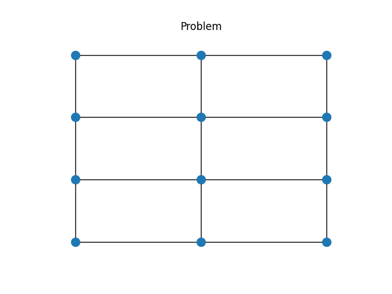
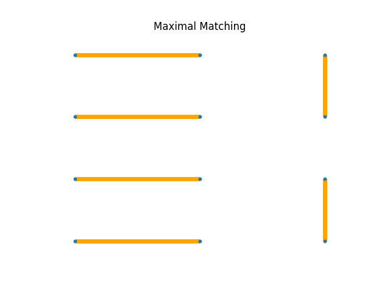
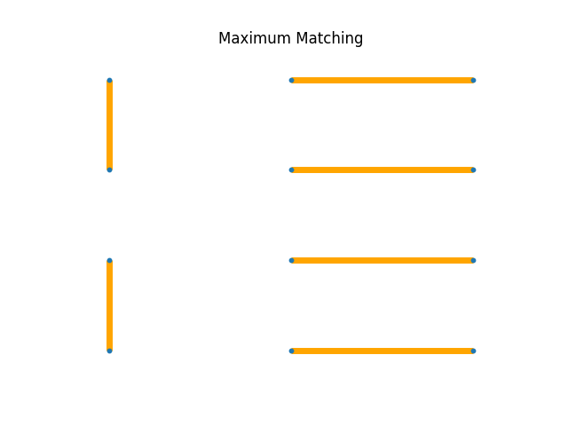

# 5章 : マッチング

### マッチングに関するPythonファイル

 - マッチング問題の描画 : `problem.py`
 - 極大マッチングの描画 : `maximal_matching.py`
 - 最大マッチングの描画 : `maximum_matching.py`
 - 2部グラフの描画 : `twopart_matching_drawing.py`
 - 2部グラフの解決 : `twopart_matching_solving.py`

paperフォルダに2部マッチングの論文があります。

***

## マッチング問題

使うライブラリは以下

```python
import networkx as nx
import matplotlib.pyplot as plt
```

現在12人おり、その人たちは自分の前後左右のいずれかの人から一人を選び手を繋ぐことができる。手を繋ぐ人数を最大にするには、どのようにしたら良いのだろうか。  
この問題は3行4列で以下のように表せる。



またコードは次で実装される

```python
m, n = 3, 4
G = nx.grid_2d_graph(m, n)
pos = {(i, j): (i, j) for (i, j) in G.nodes()} 

plt.figure()
plt.title("Problem")
nx.draw(G, pos=pos, node_size=100)
plt.show()
```

この問題に対する答えの一つとして極大マッチングがあり、以下のコードで実装される。

```python
edges = nx.maximal_matching(G)

plt.title("Maximal Matching")
nx.draw(G, pos=pos, width=5, node_size=10, edgelist=edges, edge_color="orange")
plt.show()
```



さらに最大マッチングというものもあり、以下のコードで実装される。

```python
pos = {(i, j): (i, j) for (i, j) in G.nodes()} 
edges = nx.max_weight_matching(G)

plt.title("Maximum Matching")
nx.draw(G, pos=pos, width=5, node_size=10, edgelist=edges, edge_color="orange")
plt.show()
```



極大マッチングと、最大マッチングのグラフが左右反転しているだけで一致しているが、極大マッチングは10人と手を繋ぐことになることもあるが、最大マッチングは必ず12人と手を繋ぐことができる。