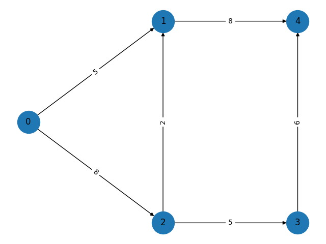
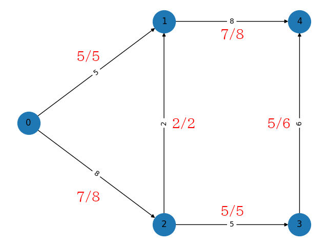

# 4章 : ネットワークフローと最大流問題

使うライブラリは以下

```python
import networkx as nx
import matplotlib.pyplot as plt
```

次のコードは最大流問題を解決する

```python
G = nx.DiGraph()

capacity = {(0, 1): 5, (0, 2): 8, (1, 4): 8, (2, 1): 2, (2, 3): 5, (3, 4): 6}

for (i, j) in capacity:
    G.add_edge(i, j, capacity=capacity[i, j])

value, flow = nx.maximum_flow(G, _s=0, _t=4)

print(f"value = {value}")
print(f"flow  = {flow}")
```

実行すると以下の結果が得られる。

```
value = 12
flow  = {0: {1: 5, 2: 7}, 1: {4: 7}, 2: {1: 2, 3: 5}, 4: {}, 3: {4: 5}}
```

グラフの描画に関しては次のコードで行う。

```python
pos = {0: (0, 1), 1: (1, 2), 2: (1, 0), 3: (2, 0), 4: (2, 2)}
edge_labels = {}

for (i, j) in G.edges():
    edge_labels[i, j] = f"{G[i][j]['capacity']}"

plt.figure()
nx.draw(G, pos=pos, with_labels=True, node_size=1000)
nx.draw_networkx_edge_labels(G, pos, edge_labels=edge_labels)
plt.show()
```

このコードを実行すると以下の結果が得られる。



この画像に、得られた最適解を記すと以下となる。

