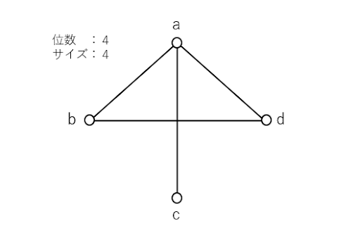
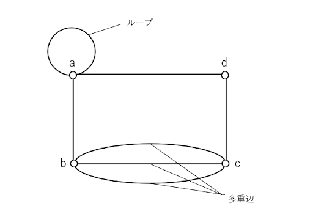

# Pythonで学ぶグラフ理論

グラフ理論を学ぶ上で、定義は非常に大切なものです。しかし、定義に関してPythonで表現できる部分は限られていますので、表現できるところを記述していく方向で進めていきます。

### 定義

1. 集合
2. グラフ
3. 多重グラフ
4. 順序対
5. 有効グラフ
6. 部分集合
7. 部分グラフ
8. 写像
9. グラフの同型
10. 集合の和, 積
11. 次数
12. 有効グラフの次数
13. 正則グラフ
14. 歩道, 道, 閉路
15. 有向道, 有向閉路
16. 切断点, 橋
17. 内素な道
18. 距離, 直径

***


# 定義1 : 集合とは

集合：異なるものの集まり  

Pythonには組み込み関数として`set()`が用意されている。これは集合という意味であり、データは`{}（波括弧）`に囲われて表現される。また`set()`されたデータは一意に扱われる。

```python
X = {"a", "b", "c"}
print(type(X))
# <class 'set'>

Y = ["a", "a", "b", "c"]
print(set(Y))
# {"a", "b", "c"}
```

上記のように配列`Y`に`a`が2つ含まれている、つまり重複している場合は`set()`により一意なデータとして変換される。ここで集合に格納された値のことを**要素**、あるいは**元**という。ここでは「`a`, `b`, `c`」が要素である。また、要素が一つもないことを**空集合**といい、要素数が有限の場合は**有限集合**、無限の場合は**無限集合**と呼ぶ。

集合は`X = {1, 2, 3, 4}`のように要素を表現することもあるが、要素の性質を用いて`X = {x|xは4以下の自然数}`と表すこともできる。Pythonで表すとおおよそ以下で正しいだろう。また**n元集合**とは要素数をnとした時の有限集合のことである。
```python
X = {1, 2, 3, 4}
X = lambda x: True if x <= 4 else False
```

### 用語
 - 集合
 - 要素, 元
 - 空集合
 - 有限集合
 - 無限集合
 - n元集合 

*** 

# 定義2 : グラフ

グラフ : 頂点と辺からなるもの

グラフとは頂点（点）の集合（**頂点集合**）と辺の集合（**辺集合**）によって構成される。頂点集合、辺集合がともに有限であるものを**有限グラフ**という。グラフの頂点の数は**位数**と呼ばれ、グラフの辺の数は**サイズ**と呼ばれる。



以下はグラフを通しての理解が効率的だと判断したため箇条書きで記している（太字部分が新しい用語）。カッコの中は各用語の説明である。

 - aとbは**隣接**（辺を成している）
 - cとdは**非隣接**（辺を成していない）
 - 辺adの**端点**は頂点a, d（辺を構成している頂点）
 - 頂点dの**近傍**は頂点a, b（自身の頂点と辺を成している頂点）
 - 頂点aに**接続している**辺は、ab, ac, ad（自身が辺を構成する一部である）


### 用語
 - グラフ
 - 頂点, 点, 端点
 - 頂点集合
 - 辺集合
 - 有限グラフ
 - 位数
 - サイズ
 - 隣接する
 - 接続する
 - 近傍

***

# 定義3 : 多重グラフ

多重グラフ : 多重辺やループを許したグラフ

**多重辺**とは2頂点を結ぶ辺が2本以上ある辺のこと。例えば頂点a, bで辺を成すものが2本あり、それぞれの辺の名前を「A, B」としたとき「A, B」はともに多重辺である。つまり、辺を構成する端点が同一のものが2本以上ある場合のこと。次に**ループ**だが、これは端点が同じ辺のこと。また、多重辺やループを持たないグラフを**単純グラフ**、あるいは単にグラフと呼ぶ。定義2のグラフは単純グラフである。



### 用語
 - 多重辺
 - ループ
 - 多重グラフ
 - 単純グラフ