# グラフ理論

## 参照

 - [例題で学ぶグラフ理論](https://www.amazon.co.jp/dp/4627052812)
 - [Matching](https://matching.readthedocs.io/en/latest/index.html)

***

## 定義

1. 集合
2. グラフ
3. 多重グラフ
4. 順序対
5. 有効グラフ
6. 部分集合
7. 部分グラフ
8. 写像
9. グラフの同型
10. 集合の和, 積
11. 次数
12. 有効グラフの次数
13. 正則グラフ
14. 歩道, 道, 閉路
15. 有向道, 有向閉路
16. 切断点, 橋
17. 内素な道
18. 距離, 直径

***

# 定義1 : 集合とは

集合：異なるものの集まり  

Pythonには組み込み関数として`set()`が用意されている。これは集合という意味であり、データは`{}（波括弧）`に囲われて表現される。また集合ではデータが一意に扱われる。

```python
X = {"a", "b", "c"}
print(type(X))
# <class 'set'>

Y = ["a", "a", "b", "c"]
print(set(Y))
# {"a", "b", "c"}
```

上記のように集合`Y`に`a`が2つ含まれている、重複している場合は`set()`により一意なデータとして変換される。ここで集合に格納された値のことを**要素**、あるいは**元**という。ここでは「`a`, `b`, `c`」が要素である。また、要素が一つもないことを**空集合**といい、要素数が有限の場合は**有限集合**、無限の場合は**無限集合**と呼ぶ。

集合は`X = {1, 2, 3, 4}`のように要素を表現することもあるが、要素の性質を用いて`X = {x|xは4以下の自然数}`と表すこともできる。Pythonで表すとおおよそ以下で正しいだろう。また**n元集合**とは要素数をnとした時の有限集合のことである。

```python
X = {1, 2, 3, 4}
X = lambda x: True if x <= 4 else False
```

### 用語

 - 集合
 - 要素, 元
 - 空集合
 - 有限集合
 - 無限集合
 - n元集合 

*** 

# 定義2 : グラフ

グラフ : 頂点と辺からなるもの

グラフとは頂点（点）の集合（**頂点集合**）と辺の集合（**辺集合**）によって構成される。頂点集合、辺集合がともに有限であるものを**有限グラフ**という。グラフの頂点の数は**位数**と呼ばれ、グラフの辺の数は**サイズ**と呼ばれる。

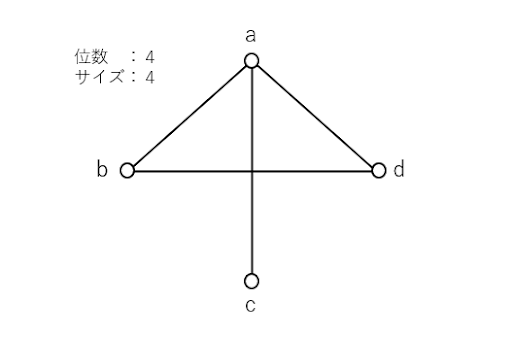

以下はグラフを通しての理解が効率的だと判断したため箇条書きで記している（太字部分が新しい用語）。カッコの中は各用語の説明である。

 - aとbは**隣接**（辺を成している）
 - cとdは**非隣接**（辺を成していない）
 - 辺adの**端点**は頂点a, d（辺を構成している頂点）
 - 頂点dの**近傍**は頂点a, b（自身の頂点と辺を成している頂点）
 - 頂点aに**接続している**辺は、ab, ac, ad（自身が辺を構成する一部である）

### 用語

 - グラフ
 - 頂点, 点, 端点
 - 頂点集合
 - 辺集合
 - 有限グラフ
 - 位数
 - サイズ
 - 隣接する
 - 接続する
 - 近傍

***

# 定義3 : 多重グラフ

多重グラフ : 多重辺やループを許したグラフ

**多重辺**とは2頂点を結ぶ辺が2本以上ある辺のこと。例えば頂点a, bで辺を成すものが2本あり、それぞれの辺の名前を「A, B」としたとき「A, B」はともに多重辺である。つまり、辺を構成する端点が同一のものが2本以上ある場合のこと。次に**ループ**だが、これは端点が同じ辺のこと。また、多重辺やループを持たないグラフを**単純グラフ**、あるいは単にグラフと呼ぶ。定義2のグラフは単純グラフである。

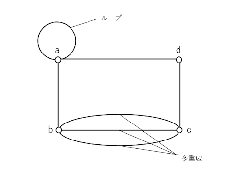

### 用語
 - 多重辺
 - ループ
 - 多重グラフ
 - 単純グラフ

***

# 定義4 : 順序対

順序対 : 決められた順序に並べられた対象の対

**順序対**は`(a, b)`で表され、a, bそれぞれを第一成分、第二成分と呼ぶ。aとbの値が異なる場合`(a, b)`と`(b, a)`は異なる順序対である。順序対とは要するに、多重グラフにおける多重辺に順序が加えられたものだと考えればよい。また、`(a, a)`となる順序対も存在する。  
順序対は次の定義5で扱われる。

```python
a = 10
b = 20

X = (a, b)
Y = (b, a)

print(X == Y)
# False
```

### 用語
 - 順序対

***

# 定義5 : 有向グラフ

有向グラフ : 辺に向きのあるグラフ

辺に向きのあるグラフのことを**有向グラフ**（ダイグラフ）と呼び、頂点集合と**弧**（有向辺）と呼ばれる頂点の順序対の集合（弧集合）によって構成される。

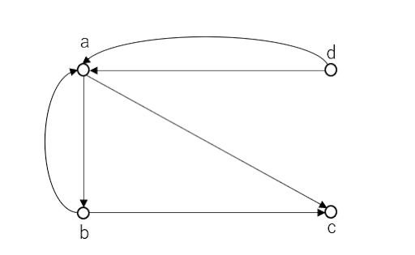

有向グラフに対して、向きのないグラフを**無向グラフ**、あるいは単にグラフと呼ぶ。これまで扱っていたのは無向グラフである。上の図で`(a, b)`と`(b, a)`は順序対であり、第一成分は**始点**、第二成分は**終点**とよばれる。また、`(a, b)`と`(b, a)`は**対象弧**でもある。さらに、同一の`(始点、終点)`を持つ2本以上の弧を**多重弧**と呼ぶ。ここでは`(d, a)`の弧が2本あるため、これは多重弧である。  
多重弧やループを許した有向グラフを**多重有向グラフ**、あるいは**多重ダイグラフ**と呼び、多重辺やループを持たないグラフを**単純有向グラフ**、あるいは単に有向グラフ（ダイグラフ）と呼ぶ。上の図は多重有向グラフである。また。定義2のグラフに順序がついたものが単純有向グラフである。

### 用語

 - 有向グラフ, ダイグラフ
 - 弧, 有向辺
 - 弧集合
 - 無向グラフ
 - 始点
 - 終点
 - 対象弧
 - 多重弧
 - 多重有向グラフ, 多重ダイグラフ
 - 単純有向グラフ

***

# 定義6 : 部分集合

以下の`A`は要素として`1, 3, 5`を有しており、`B`は`A`の要素に加え、`2, 4`の要素を有している。この時`B`は`A`の要素を含んでおり、これを`A`は`B`の**部分集合**であると表現する。また、空集合は任意の集合の部分集合である。

```python
A = {1, 3, 5}
B = {1, 2, 3, 4, 5}

C = A & B

print(A == C)
# True
```

### 用語

 - 部分集合

***

# 定義7 : 部分グラフ

部分グラフ : 元となるグラフの一部となるグラフ

**部分グラフ**とは、元となるグラフがあり、その一部であるグラフのこと。とくに、頂点が完全に一致しているものを**全域部分グラフ**と呼ぶ。さらに**誘導部分グラフ**とは、ある頂点を基準にしたときに、その頂点が構成する辺が、すべて元のグラフに含まれている時を指す。

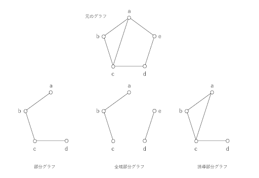

### 用語

 - 部分グラフ
 - 全域部分グラフ
 - 誘導部分グラフ

***

# 定義8 : 写像

写像 : 集合から集合へ要素を対応させること

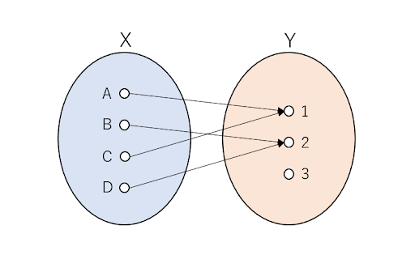

上の図をもとに写像について説明する。集合`X`は要素`{A, B, C, D}`を有している。集合Yは要素`{1, 2, 3}`を有している。ここでは分かりやすくするために、結婚相手を考えるものとする。集合`X`は女性の集団であり、呼称を各要素に「さん」をつけて呼ぶこととする（例：Aさん）。集合Yも同様の呼称とする。この時、例えばAさんは1さんと結婚したいと考えており、これは以下のプログラムでのAさんの値1と対応する。この値を使い`(A, 1)`とすることをAから1への**写像**という。ここでは左から右への向きを持つ。  

次に、2さんは自分と結婚したい人がいるかどうか確認したいとする。その場合は、自分の「2」という名前を使い、女性の集団から自分と結婚したい人を探すことになる。そうするとBさんとDさんがいることになる。矢印とは逆方向（右から左）から「対応する要素が存在すること」を**上への写像**という。

次に、集合`X`のどの2個の要素も集合`Y`の異なる要素に対応するとき、つまり結婚相手がかぶらないとき、`X`から`Y`への**1対1の写像**という。ここでは集合`X`からAさんとBさんで1対1の写像となっている。

```python
# 女性視点の結婚したいリスト
# key  : 女性
# value: 結婚したい男性
women_ideal = {
    "A": 1,
    "B": 2,
    "C": 3,
    "D": 2,
}

# 男性
men = {1, 2, 3}

for man in men:
    for woman, ideal in women_ideal.items():
        if ideal == man:
            print(f"{man}さんと結婚したい人には{woman}さんがいる")

# - Result - 
# 1さんと結婚したい人にはAさんがいる
# 2さんと結婚したい人にはBさんがいる
# 2さんと結婚したい人にはDさんがいる
# 3さんと結婚したい人にはCさんがいる
```

### 用語

 - 写像
 - 上への写像
 - 1対1の写像

***

# 定義9 : グラフの同型

グラフの同型 : 「同一」の頂点を持ち、同一の辺の繋がり方をしているグラフ

グラフを並び変えたり、回転させたりすることで、同じグラフが存在する場合のこと。以下のグラフで左のグラフと真ん中のグラフは同型ではなく、同型なのは左と右のグラフである。

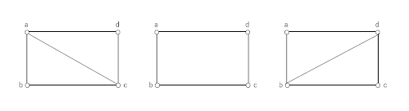

また、以下のグラフは片方を並び変えることで、もう片方のグラフと同じ形を作ることができるため同型である。

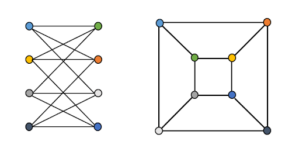

### 用語

 - 同型

***

# 定義10 : 集合の和, 積

この定義10のプログラムでは、以下のモジュールを共通して使う。

```python
import matplotlib.pyplot as plt
import networkx as nx
```

集合`A`と集合`B`に対して、**和集合**とは集合`A`と集合`B`のいずれかに属している要素全体からなる集合のこと。
また**積集合**とは、集合Aと集合Bの両方に属している要素全体からなる集合のこと。
集合`A`と集合`B`の積集合が空集合であるとき、これらは**互いに素**であるという。
以下のプログラムで、`C1`は`A1`と`B1`の和集合である。`D2`は、`A1`と`B1`の積集合であるが、空集合であるため、A1とB1は互いに素であるといえる。
また、`C2`は`A2`と`B2`からなる積集合であり、互いに素ではない。

```python
A1 = {1, 2, 3}
B2 = {4, 5, 6}
C1 = A1 | B2
D2 = A1 & B2
print(C1) # {1, 2, 3, 4, 5, 6}
print(D2) # {}

A2 = {1, 2, 3, 4, 5}
B2 = {3, 4, 5, 6, 7}
C2 = A2 & B2
print(C2) # {3, 4, 5}
```

以下の画像で完全グラフについて考える。
**完全グラフ**は、異なる2頂点がすべて隣接しているグラフのこと。
それぞれの頂点は隣接しており、1つだけの頂点を持つ部集合であるといえる。
この時のグラフは頂点数5つのクリークであるという。クリークは、完全グラフと同型な部分グラフの頂点集合のことである。

**`definition_src/complete_graph.py`**

```python
graph_data = {
    1: [2, 3, 4, 5],
    2: [1, 3, 4, 5],
    3: [1, 2, 4, 5],
    4: [1, 2, 3, 5],
    5: [1, 2, 3, 4]
}

nodes = [i for i in graph_data.keys()]
patterns = []
for top, connect_tops in graph_data.items():
    for connect_top in connect_tops:
        patterns.append((top, connect_top))

G = nx.Graph()
G.add_nodes_from(nodes)
G.add_edges_from(patterns)
nx.draw(G, with_labels=True)
plt.show()
```

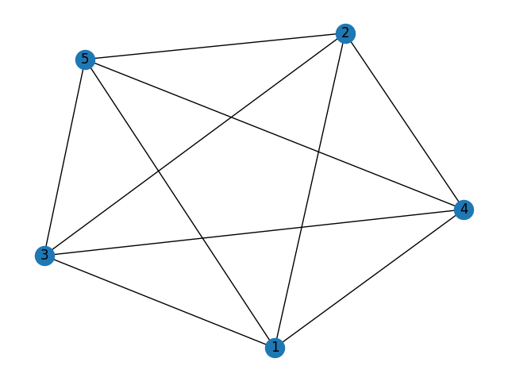

グラフ`G`の頂点集合`V(G)`を互いに素な部分集合`V1`, `V2`に分割し、`V1`の頂点同士、V2の頂点同士が隣接しないようにできるとき、`G`を**2部グラフ**と呼び、`V1`, `V2`を**部集合**と呼ぶ。部集合`V1`, `V2`を持つ2部グラフGにおいて`V1`の各頂点が、`V2`の全ての頂点と隣接しているとき、Gを**完全2部グラフ**と呼ぶ。また、部集合の数をnとしたとき、**n部グラフ**、**完全n部グラフ**が存在する。

**2部グラフ**

**`definition_src/bipartite_graph.py`**

```python
A = {
    1: [4, 5], 
    2: [5], 
    3: [6]
}
B = {
    4: [1, 2], 
    5: [2], 
    6: [3]
}

A_nodes = [i for i in A.keys()]
B_nodes = [i for i in B.keys()]
nodes = A_nodes + B_nodes

patterns = []
for top, connect_tops in A.items():
    for connect_top in connect_tops:
        patterns.append((top, connect_top))

for top, connect_tops in B.items():
    for connect_top in connect_tops:
        patterns.append((top, connect_top))

G = nx.Graph()
G.add_nodes_from(nodes)
G.add_edges_from(patterns)
nx.draw(G, with_labels=True)
plt.show()
```

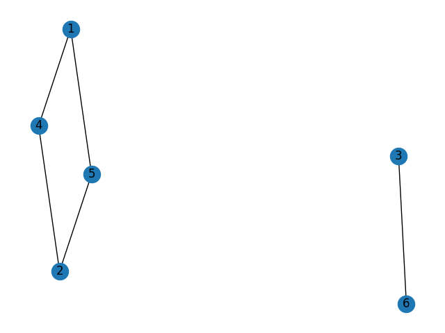

**完全2部グラフ**

**`definition_src/complete_bipartite_graph.py`**

```python
A = {
    1: [4, 5, 6], 
    2: [4, 5, 6], 
    3: [4, 5, 6]
}
B = {
    4: [1, 2, 3], 
    5: [1, 2, 3], 
    6: [1, 2, 3]
}

A_nodes = [i for i in A.keys()]
B_nodes = [i for i in B.keys()]
nodes = A_nodes + B_nodes

patterns = []
for top, connect_tops in A.items():
    for connect_top in connect_tops:
        patterns.append((top, connect_top))

G = nx.Graph()
G.add_nodes_from(nodes)
G.add_edges_from(patterns)
nx.draw(G, with_labels=True)
plt.show()
```

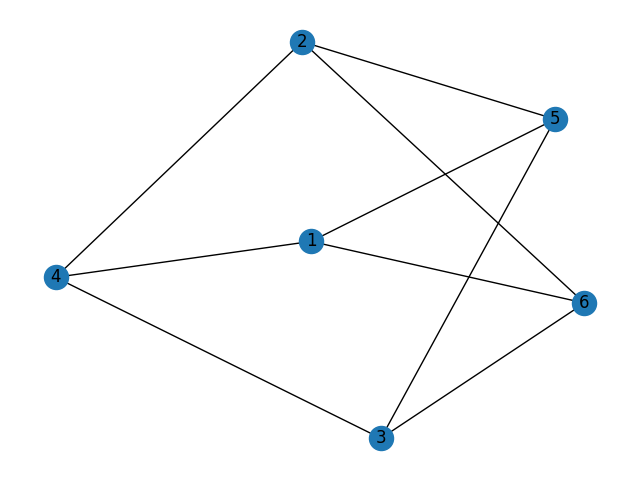

頂点集合の最後のインデックスが、どの頂点とも隣接しないときのグラフを**道グラフ**、あるいは単に**道**という。

**`definition_src/path_graph.py`**

```python
graph_data = {
    1: [2],
    2: [3],
    3: [4],
    4: []
}
nodes = [i for i in graph_data.keys()]
patterns = []
for top, connect_tops in graph_data.items():
    for connect_top in connect_tops:
        patterns.append((top, connect_top))

G = nx.Graph()
G.add_nodes_from(nodes)
G.add_edges_from(patterns)
nx.draw(G, with_labels=True)
plt.show()
```

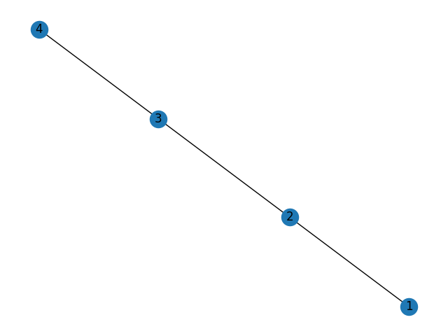

道グラフの最後のインデックスが最初のインデックスと隣接する時のグラフを**閉路**という。

**`definition_src/cycle.py`**

```python
graph_data = {
    1: [2],
    2: [3],
    3: [4],
    4: [1]
}

nodes = [i for i in graph_data.keys()]
patterns = []
for top, connect_tops in graph_data.items():
    for connect_top in connect_tops:
        patterns.append((top, connect_top))

G = nx.Graph()
G.add_nodes_from(nodes)
G.add_edges_from(patterns)
nx.draw(G, with_labels=True)
plt.show()
```

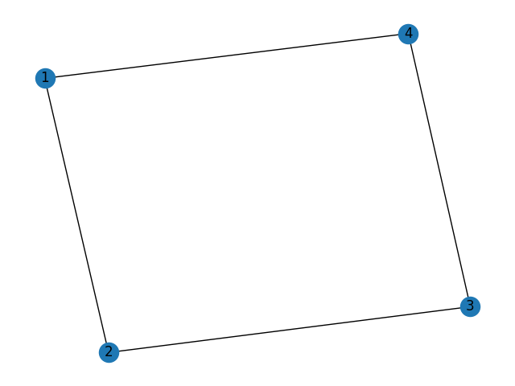

### 用語

 - 和集合
 - 積集合
 - 互いに素
 - 完全グラフ
 - クリーク
 - 2部グラフ
 - 部集合
 - 完全2部グラフ
 - n部グラフ
 - 完全n部グラフ
 - 道
 - 閉路

***

# 定義11 : 次数

グラフ`G`の頂点`v`に接続している辺の本数を**次数**という。次数が偶数、あるいは奇数である頂点をそれぞれ**偶点**、**奇点**と呼ぶ。また、次数0の頂点を**孤立点**と呼ぶ。

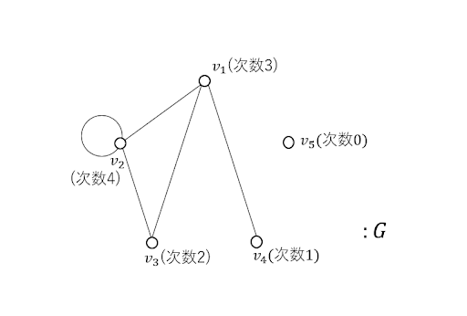

### 用語

 - 次数
 - 偶点
 - 奇点
 - 孤立点

***

# 定義12 : 有向グラフの次数

有向グラフ`D`の点`v`を始点としている弧の本数を`v`の**出次数**という。また、頂点`v`を終点としている弧の本数をvの**入次数**という。

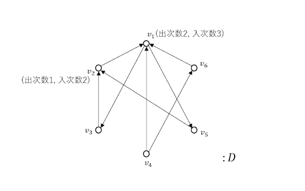

### 用語

 - 出次数
 - 入次数

***

# 定義13 : 正則グラフ

全ての頂点の次数が同じ`r`であるグラフを**正則グラフ**、あるいは**r-正則グラフ**という

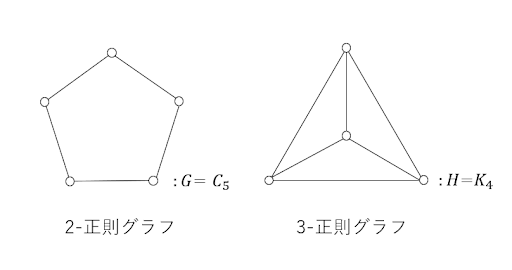

### 用語

 - 正則グラフ

***

# 定義14 : 歩道, 道, 閉路

**隣接行列**とは、列と行がグラフの頂点に対応したn次の正方行列のこと。

**`definition_src/adjacency_matrix.py`**
```python
import matplotlib.pyplot as plt
import networkx as nx
import numpy as np


A = np.array([
    [0, 1, 1, 1], 
    [1, 0, 1, 0],
    [1, 1, 0, 1],
    [1, 0, 1, 0]
])
tmp = nx.MultiGraph()
G = nx.from_numpy_matrix(A, parallel_edges=True, create_using=tmp)
nx.draw(G, with_labels=True)
plt.show()
```

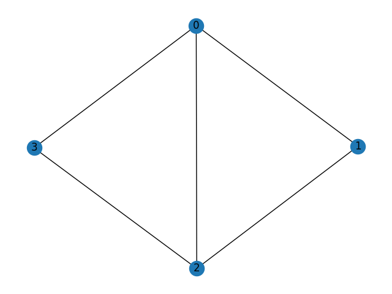

グラフ`G`の**歩道**とは、ある頂点から接続している辺と頂点を交互に通過していく道筋のこと。
歩道`W`の始まりの頂点を`W`の**始点**、終わりの頂点を`W`の**終点**という。
また、`W`に含まれている辺の本数nをWの長さという。始点と終点を歩道Wの**端点**という。
始点と終点が一致しているときは歩道は**閉じている**という。
同じ辺を含まない歩道を**小道**、同じ頂点を含まない歩道を**道**という。
閉じた小道を**回路**、閉じた道を**閉路**という。閉路は、その長さが偶数の時、**偶閉路**、奇数の時は**奇閉路**という。

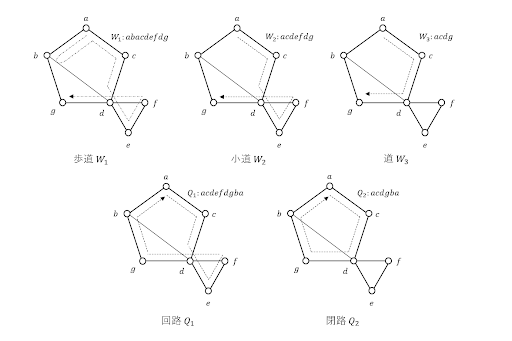

### 用語

 - 隣接行列
 - 歩道
 - 始点
 - 終点
 - 長さ
 - 端点
 - 閉じている
 - 小道
 - 道
 - 回路
 - 閉路
 - 偶閉路
 - 奇閉路

***

# 定義15 : 有向道, 有向閉路

有向グラフに関する有向小道、有向道、有向回路、有向閉路は、
それぞれグラフにおける小道、道、回路、閉路の各辺を同じ向きの弧に置き換えたものである。

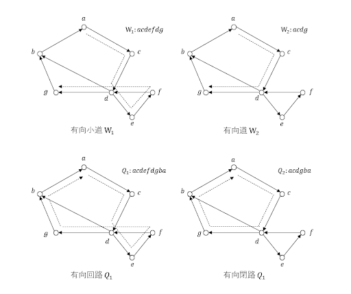

### 用語

 - 有向小道
 - 有向道
 - 有向回路
 - 有向閉路

***

# 定義16 : 切断点, 橋

ある頂点が連結グラフを分けることがあるとき、この頂点を**切断点**と呼ぶ。
切断点を繋ぐ辺のことを**橋**と呼ぶ。
切断点が集まった集合によって、連結グラフを**分離する**とき、この集合を**切断集合**という。
切断点は1頂点からなる切断集合である。

### 用語

 - 切断点
 - 橋
 - 切断集合
 - 分離する

***

# 定義17 : 内素な道

始点と終点が同じ2本の道`P1`と`P2`が**内素**であるとは、`P1`と`P2`が始点と終点以外に共有店を持たないことである。

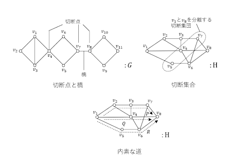

### 用語

 - 内素

***

# 定義18 : 距離, 直径

グラフ`G`の2頂点`u`, `v`を結ぶ道の中で、最も長さの短い長さを、`u`と`v`の**距離**という。
連結グラフ`G`に対して、`u`と`v`がそれぞれグラフの始点と終点であるときの距離を**直径**という。

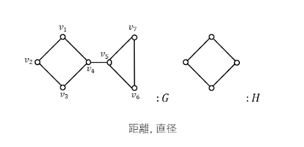

### 用語

 - 距離
 - 直径
